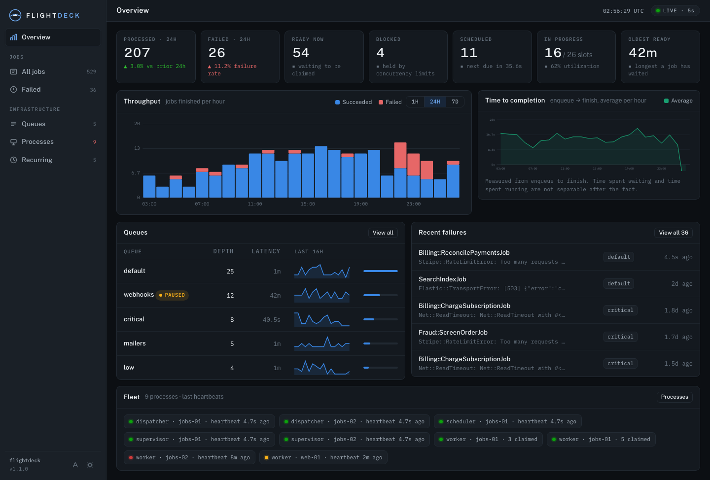
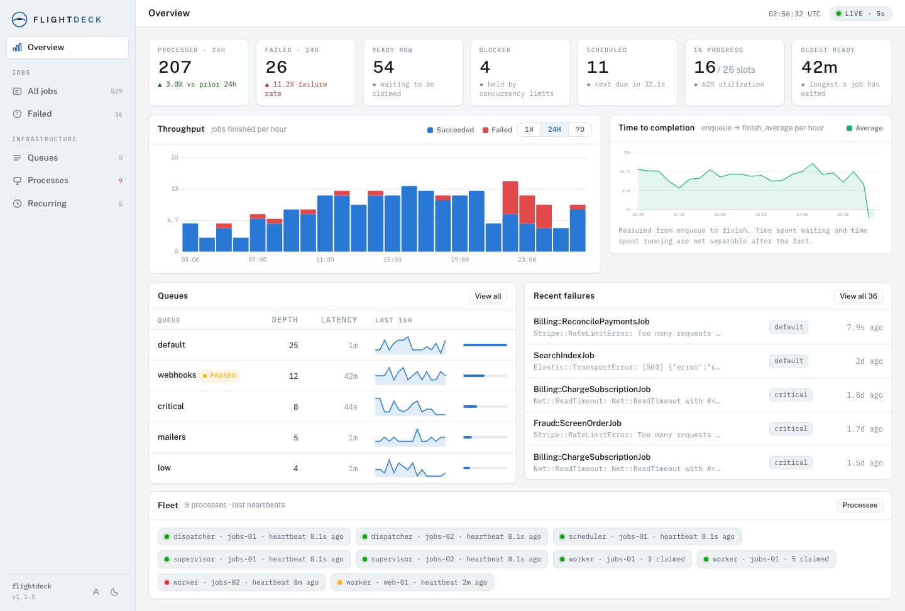
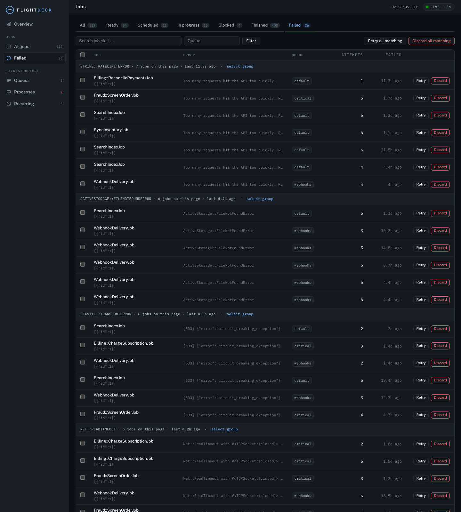
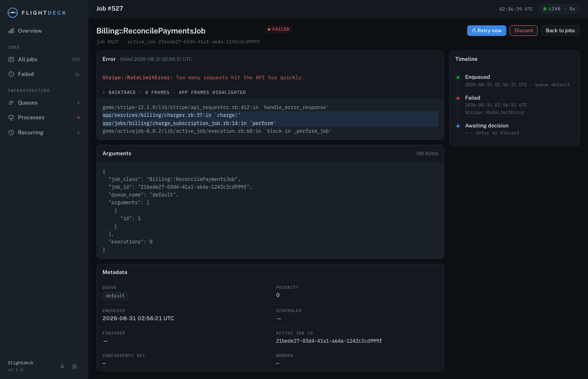
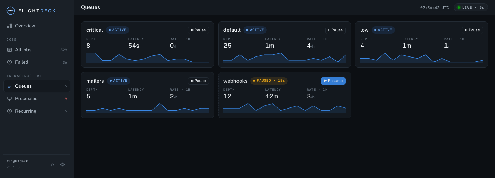
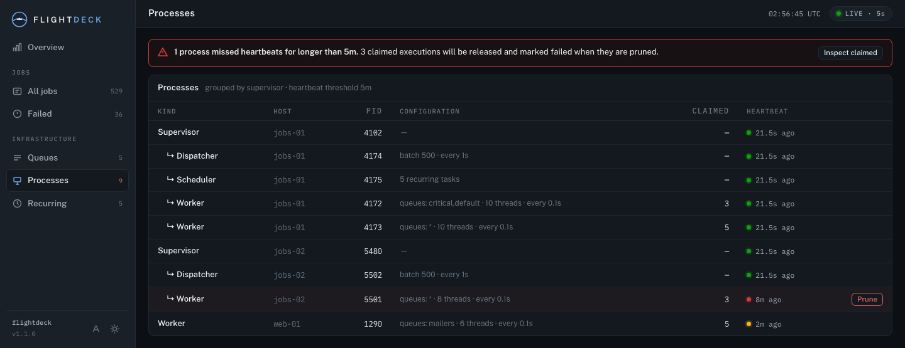

# Flightdeck

A dashboard for [Solid Queue](https://github.com/rails/solid_queue) that is
pleasant to look at and actually operational. Where Mission Control gives you
lists, Flightdeck gives you a console: live-polling panels, throughput and
completion-time charts computed straight from the Solid Queue tables, failure
triage with grouping and bulk retry, queue pause/resume, fleet health with
heartbeat detection, and recurring-task control. It ships precompiled assets
(no pipeline configuration), works in API-only apps, mounts anywhere, and
refuses to serve a single unauthenticated request.




<details>
<summary><strong>More screenshots</strong> — failed jobs, job detail, queues, processes</summary>






</details>

## Installation

```ruby
# Gemfile
gem "solid_queue-flightdeck"
```

No migrations, no asset configuration. Requires Ruby >= 3.1, Rails >= 7.1 and
Solid Queue >= 1.0.

## Mounting

```ruby
# config/routes.rb
mount Flightdeck::Engine => "/flightdeck"
```

Any path works, including nested ones — every URL Flightdeck emits comes from
the request's own script name. Nested mounts have their own test suite.

## Authentication

**Flightdeck returns 401 until you configure it, in every environment.** It can
retry, discard and delete jobs, so there is no default that lets anyone in.

### Behind your app's own authentication (recommended)

The usual shape — gate the route with Devise, and hand Flightdeck the same base
controller your other admin pages use:

```ruby
# config/routes.rb
authenticated :user, lambda { |u| u.admin? } do
  namespace :admin do
    root to: "dashboard#index"
    mount Flightdeck::Engine, at: "/jobs"
  end
end
```

```ruby
# config/initializers/flightdeck.rb
Flightdeck.configure do |config|
  config.base_controller_class = "Admin::BaseController"
end
```

> **The routing constraint alone is not enough.** Flightdeck does not inspect
> your routes; it refuses to serve until it is told how to authenticate. Setting
> `base_controller_class` makes your controller's `before_action`s Flightdeck's
> gate and skips its own challenge entirely. Without it, the engine still
> answers 401 behind the constraint.

### HTTP Basic

For apps without such a base controller. Any one of these is enough:

```bash
FLIGHTDECK_USERNAME=admin FLIGHTDECK_PASSWORD=a-long-secret
```

```yaml
# bin/rails credentials:edit
flightdeck:
  username: admin
  password: a-long-secret
```

```ruby
Flightdeck.configure do |config|
  config.http_basic = { username: "admin", password: "a-long-secret" }
end
```

`http_basic` also accepts a callable, re-evaluated per request, for rotating
credentials. Credentials are compared with `secure_compare` and read per
request, never memoized at boot.

In **API-only** apps there is no host session for Devise to use, so use
Flightdeck's own HTTP Basic there.

### Disabling authentication entirely

```ruby
# config/initializers/flightdeck.rb
Flightdeck.configure do |config|
  config.skip_authentication = true
end
```

This serves the dashboard — which can retry, discard and delete jobs — to
anyone who can reach the mount. It exists for deployments where something
upstream already guards it: a routing constraint, a VPN, a reverse proxy. The
routing-constraint caveat above still applies unless you set this: without it,
the engine answers 401 behind your constraint.

## Configuration

| Option | Default | Purpose |
| --- | --- | --- |
| `base_controller_class` | `nil` | Controller (a String) to inherit from, to reuse your app's authentication. |
| `http_basic` | `nil` | `{ username:, password: }` or a callable. Falls back to `ENV`, then credentials. |
| `skip_authentication` | `false` | Serve without any authentication. For mounts guarded upstream (routing constraint, VPN, proxy). |
| `poll_interval` | `5.seconds` | Refresh rate for list and stat panels. |
| `chart_poll_interval` | `30.seconds` | Refresh rate for charts. |
| `per_page` | `25` | Rows per page in job lists. |
| `count_cap` | `500_000` | Counting stops here; rendered as `500,000+`. |
| `bulk_action_limit` | `1_000` | Cap on jobs touched by one bulk retry/discard. |
| `chart_cache_ttl` | `30.seconds` | How long chart series are cached. |
| `display_timezone` | `"UTC"` | Timezone for displayed timestamps. Queries stay in UTC. |
| `backtrace_lines` | `50` | Backtrace frames shown on job detail. |
| `ui_font` | `"public-sans"` | Default interface typeface. Each user can pick another one in the sidebar. |

## Interface font

The bottom of the sidebar has a font picker, and the choice is remembered per
browser. To set the default everyone starts on:

```ruby
Flightdeck.configure do |config|
  config.ui_font = "inter"
end
```

Available: `public-sans` (default), `barlow`, `general-sans`, `inter`,
`manrope`, and `system` (whatever your OS uses for its own UI, no webfont
downloaded). Anything else raises at boot rather than falling back silently.

All faces ship with the gem — nothing is fetched from Google Fonts or any other
CDN at runtime, so the dashboard works on an isolated network and leaks no
requests to third parties. They are served as ordinary digest-named assets
rather than inlined, so a browser only downloads the one face it is rendering
in. The monospace face (IBM Plex Mono) is fixed: the job tables depend on its
tabular figures.

## Chart history and job retention

Flightdeck adds no tables and changes no retention: charts read Solid Queue's
own rows, so history is bounded by your app's Solid Queue purge setting.
Finished jobs are deleted after `clear_finished_jobs_after` — **1 day by
default** — which leaves a 7-day throughput chart mostly empty. To keep charts
honest for the windows you care about, raise it to at least the longest window:

```ruby
# config/application.rb (or an environment file)
config.solid_queue.clear_finished_jobs_after = 14.days
```

The cost is `solid_queue_jobs` table size — retention × throughput (100k
jobs/day × 14 days ≈ 1.4M rows). Flightdeck's chart queries are windowed and
index-backed, and counts are capped, so the dashboard stays fast at that size.
Failed jobs are unaffected: Solid Queue never purges them automatically.

## API-only apps

Works unchanged. Flightdeck carries its own cookies, session
(`_flightdeck_session`) and flash as engine-local middleware wrapping only its
own routes — your middleware stack is untouched. The whole suite runs a second
time in API-only mode.

## Solid Queue on a separate database

Nothing to configure. Every query goes through `SolidQueue::Record` and the
Solid Queue models, so your `connects_to` routing applies automatically.
Flightdeck never joins your application's tables and never touches the database
at boot — it mounts cleanly even when the queue database is unreachable.

## Development

```bash
bin/demo                       # schema + seeds + server, auth off, on :3000
bin/test                       # asset freshness + both host modes
bundle exec rake test          # fast suite
bundle exec rake test:system   # headless Chrome (skipped if none installed)
bundle exec rake screenshots   # regenerate docs/screenshots
bundle exec rake assets:build  # rebuild CSS/JS
bundle exec rubocop
bin/release                    # full release: verify, push, wait for CI, tag, gem push (--dry-run to rehearse)
```

Assets are committed, digest-named files under `app/assets/flightdeck/`, built
from `assets-src/`. Tailwind scans `app/`, so **re-run `rake assets:build` and
commit the result after changing a view** — CI fails on stale assets.

CI runs the suite against SQLite, PostgreSQL and MySQL (via `DATABASE_URL`),
each in normal and API-only mode. The database axis exists to protect
`Flightdeck::Metrics::TimeBucket`, the only adapter-specific SQL in the gem.

## Known limitations

- **Long charts undercount.** Solid Queue's `clear_finished_jobs_after` defaults
  to 1 day, so a 7-day throughput chart is missing purged jobs. Flightdeck
  annotates the chart rather than drawing the cliff as a trend. See
  [Chart history and job retention](#chart-history-and-job-retention) for the
  one-line fix.
- **No historical time-to-start.** The claimed-execution row is deleted when a
  job finishes, so how long a finished job waited is unrecoverable. The chart
  shows time to *completion* and says so.
- **Counts are capped** at `count_cap` and render as `500,000+`.
- **Bulk actions are capped** at `bulk_action_limit` or 10 seconds, committing
  per batch, then offer to continue.

## License

MIT. See [MIT-LICENSE](MIT-LICENSE).
